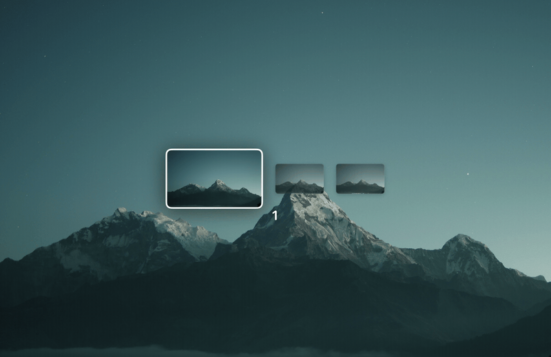

# iWheel

Hold 3 fingers on the trackpad. Your Spaces appear around your hand.
Slide, release, you are there. Never lift your hand.

macOS gives you one flat swipe between Spaces. Fine with 3, painful
with 8. iWheel puts every Space one small motion away: a wheel around
your fingers, or a dock row if that is more your thing. The name comes
from the iPod click wheel, the last input device that made moving
around feel this good.

Up to 10 Spaces.



## System requirements

- **Tested on**: macOS 26, Apple Silicon. That is the only verified
  combination.
- The public-API floor is macOS 14, so it *builds* for Sonoma and later,
  but iWheel depends on private frameworks whose behavior was only
  verified on macOS 26 - on older versions it may work, degrade, or not
  start. Reports welcome.
- Intel is untested: the app reads a private multitouch struct whose
  layout has only been validated on arm64 (out-of-range frames are
  dropped defensively, so worst case is a dead wheel, not a crash)
- A built-in trackpad or Magic Trackpad

## Install

**Download**: grab `iWheel-x.y.z.zip` from the Releases page, unzip,
move `iWheel.app` to `/Applications`, open it. The app is ad-hoc signed:
on first open, right-click > Open to get past Gatekeeper.

**Build from source**:

```sh
git clone https://github.com/gvbsxmoon/iWheel.git
cd iWheel
scripts/install.sh
```

`install.sh` does the whole dance: creates a stable local signing
identity (first run only, asks for sudo), builds, replaces the copy in
/Applications, resets permissions only when the signature actually
changed, and relaunches. For just the artifacts, `scripts/release.sh`
produces `build/iWheel.app` and the release zip.

On first launch macOS asks for three permissions (see
[Privacy & permissions](#privacy--permissions)). Grant them, then
restart the app. To start it at every login, flip "Open at login" in
Settings.

## How to use it

| Gesture | Action |
|---|---|
| Rest 3 fingers still (~0.15s) | Open the switcher |
| ctrl+option+cmd+W | Open it from the keyboard - stays open until you act |
| Keep sliding (3 fingers, or 2 in Settings) | Move the highlight through your Spaces |
| Tab | Step the highlight one Space at a time |
| Esc | Close without switching |
| Release | Switch to the highlighted Space |
| Return | Switch from the keyboard (after Tab) |
| Release without moving | Nothing happens (cancel) |
| Quick 3-finger swipe | Wheel closed: your normal macOS switch. Wheel open: ignored, the wheel stays in charge |

Pointing is relative to where your fingers were when the switcher
opened, so small movements are enough. The pointer is hidden and
clicks/scrolls do not reach the apps underneath while it is open.

Space previews are cached snapshots (like Mission Control's own
thumbnails): each Space shows how it looked the last time you were
there. A Space you have not visited yet shows your wallpaper with
its number.

## Settings

Click the menu bar icon (three stacked cards) > Settings. Every
control has a plain-language description: layout (wheel or a
dock-style row), activation hold, the open shortcut (recordable),
card size, highlight zoom, ring size or card spacing and elasticity
depending on the layout, movement threshold, dead zone, haptic
strength, open at login. A Help window in the same menu walks
through the whole flow.

Preferences are stored in `~/Library/Preferences/iWheel.plist`.

## Privacy & permissions

iWheel needs three permissions, each for one specific job:

- **Input Monitoring** - reads the raw trackpad stream (finger positions
  only). This is how the wheel knows where your fingers are.
- **Accessibility** - posts the synthetic ctrl+N keystroke that performs
  the actual desktop switch, and runs the event filter below.
- **Screen Recording** - takes the desktop snapshots used as previews.

**The keyboard filter, stated plainly:** while the switcher is open
(and only then), iWheel installs an event tap that swallows pointer
events, watches for Tab, Return and Esc, and suppresses the system's
own trackpad swipe gestures (Spaces swipe, Mission Control) so they
cannot fire mid-interaction - a swipe already in progress when the
switcher opens still completes natively. Key codes are inspected in
memory to catch those three; they are never stored, logged, or
transmitted. The tap is torn down when the switcher closes and dies
with the process, so your gestures are back to fully native the moment
it closes. The global open shortcut is registered through the system
hotkey API (RegisterEventHotKey), which delivers only that exact
combination - no event tap exists while the switcher is closed.

**Previews:** snapshots live in RAM only, are never written to disk,
never leave your machine, and are purged when the screen locks or
sleeps.

**System settings it touches:** if your "Switch to Desktop N" shortcuts
(System Settings > Keyboard > Shortcuts > Mission Control) are disabled
- the default on new Macs - iWheel enables them, because they are the
mechanism it switches with. It never deletes or modifies any other
shortcut, and never touches your trackpad gesture settings.

**No network, no analytics, no telemetry.** The app makes zero network
connections.

iWheel uses two private frameworks (MultitouchSupport for raw touches,
SkyLight for the Spaces list and cursor hiding). Consequences: it cannot
be sandboxed or distributed on the App Store, and each major macOS
release needs re-verification. See [SECURITY.md](SECURITY.md).

## Known limitations

- Max 10 Spaces reachable (ctrl+1..9 and ctrl+0 have no defaults
  beyond that)
- Single display: with multiple monitors the switcher shows and
  switches the first display's Spaces
- Fullscreen-app Spaces are not shown (they have no ctrl+N shortcut)
- The binary is unsigned: macOS ties permissions to the code hash, so
  rebuilding may reset them - re-grant and relaunch

## Troubleshooting

1. **It keeps asking for permissions after every rebuild/reinstall**:
   macOS ties permissions to the code signature, and ad-hoc signatures
   change on every build - the toggles look on but no longer match.
   Fix for source builds: run `scripts/make-signing-cert.sh` once (it
   creates a stable local signing identity), rebuild, then reset the
   stale entries with `tccutil reset All dev.lucanatale.iWheel` and
   re-grant once. Permissions then persist across rebuilds.
2. **The wheel does not appear**: check Input Monitoring permission,
   then relaunch. Run from a terminal and watch the log lines.
3. **The wheel appears but release does not switch**: iWheel repairs the
   Mission Control shortcuts automatically on first use; if it still
   fails, check System Settings > Keyboard > Shortcuts > Mission Control
   and the Accessibility permission. The on-screen message tells you
   which one is missing.
4. **Permissions look granted but nothing works**: remove iWheel from
   each permission list (minus button), re-add it, relaunch.
5. **A system gesture stopped working after a crash of an old build**:
   check System Settings > Trackpad > More Gestures. Current versions
   never modify gesture settings.

## Uninstall

Quit iWheel, delete the binary/checkout, then remove:

```sh
defaults delete iWheel 2>/dev/null
```

and remove iWheel from Privacy & Security > Input Monitoring /
Accessibility / Screen Recording.

## License

[MIT](LICENSE) - Luca Natale
